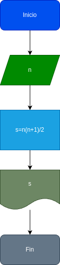

# Suma_n_Numeros
Suma de los numeros n primeros numeros naturales 

# Analisis

## Input 

### Variable de entrada
n: numero al que se desea aplicar la formula 
### Processing 
s= suma de lo n primeros numeros 

s= (n*(n+1))/2

### Output 
s
# Diseño

# Construccion

